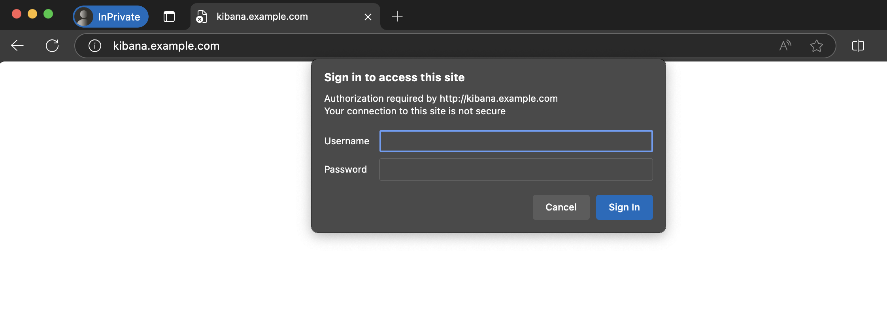
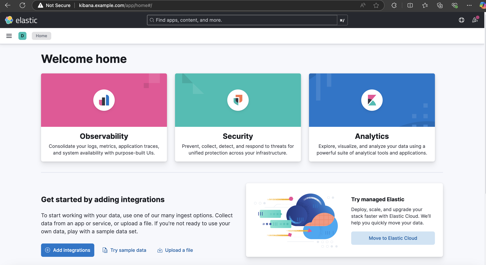
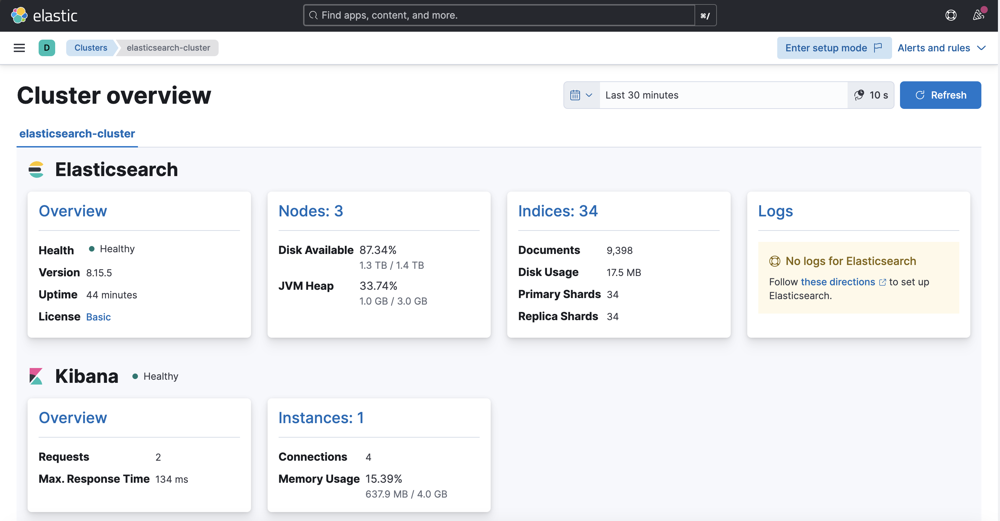

# Elk Logging using Elasticsearch v8 (Deploy in K8S)

*NOTE: This deployment is only suitable for development environments or on-premise environments with no public traffic to the internet (traffic only transmitted within the internal network) because the system does not Enable Security Transport for Elasticsearch and Kibana is secured with authentication using Basic Authentication of Nginx Ingress Controller.*

## Default value deployment

| Service | Node numbers | Note |
| :--- | :--- | :--- |
| Elasticsearch cluster  | 3 node (default persistentvolumeclaim: 5Gi) | When adding more nodes, you need to adjust the env values: **discovery.seed_hosts** & **cluster.initial_master_nodes** |
| Logtash | 1 node | |
| Kibana | 1 node | |
| Filebeat | Includes the same application as an additional container |

| Service | Docker image |
| :--- | :--- |
| Elasticsearch | docker.elastic.co/elasticsearch/elasticsearch:8.15.5 |
| Logstash | docker.elastic.co/logstash/logstash:8.15.3 |
| Kibana | docker.elastic.co/kibana/kibana:8.15.5 |
| Filebeat | docker.elastic.co/beats/filebeat:8.10.0 |

| Kubernetes service | Information |
| :--- | :--- |
| Persistent Volumes & Persistent Volume Claims | https://github.com/kubernetes-sigs/nfs-subdir-external-provisioner |
| Namespace | logging |
| Ingress Controller | https://github.com/kubernetes/ingress-nginx |
| Storage Class | nfs |

| Kibana login URL | Kibana login username | Kibana password user login |
| :--- | :--- | :--- |
| http://kibana.example.com| kibana | xxx123xxx |

## Step-by-step guide to deploy syntax

**Create namespace**
```
kubectl apply -f create-logging-ns.yaml
```

**Create Elasticsearch cluster**
```
kubectl apply -f elasticsearch-cluster.yaml
```

**Create Kibana**
```
kubectl apply -f kibana.yaml
```

**Create Logtash**
```
kubectl apply -f logstash.yaml
```

**Create app test (If you want to test or refer to make a template)**
```
kubectl apply -f app-filebeat-test-0.yaml
```
```
kubectl apply -f app-filebeat-test-1.yaml
```

**Access to Kibana**





